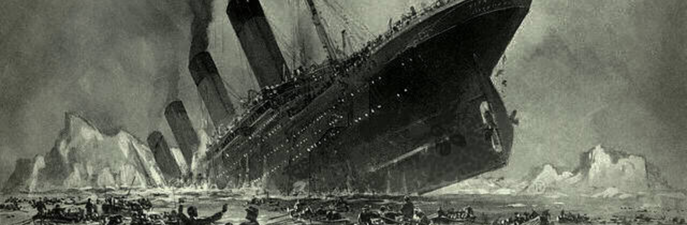

# TITANIC

## Meu diário na competição do Titanic

  

  

Estudar machine learning sem se deparar com o DataSet do Titanic é quase a mesma coisa que chupar bala com papel, definitivamente não tem a menor graça.
É quase a mesma coisa do que passar pela vida sem ter tido um fusca ou ser ter corrido uma maratona. Você simplesmente tem que fazer. 

Bem, a história do Titanic simplesmente dispensa qualquer comentário, e se você não conhece eu vou te falar um pouco sobre ele.

De forma bem simples e direta ele foi construído para ser o navio mais luxuoso e seguro do mundo. Pelo menos este era o plano inicial. Só que toda vez que os homens fazem planos, Deus dá uma bela gargalhada. 

No dia 10 de Abril de 1912 a embarcação saiu de Southampton ao sul do Reino Unido com destino a Nova Iorque. Só que no meio do caminho no dia 14 de Abril do mesmo ano ele colidiu com Iceberg o que fez com o navio sofresse danos em sua estrutura e naufragasse no dia seguinte com mais de 1500 pessoas a bordo. 

O mais foda é que o navio não tinha botes salva vidas para toda tripuluação o que acabou por gerar uma das maiores trajédias maritmas de todos os tempos. 

A história por si é sinistra, e talvez por isso os dados sobre este evento trágico chamam tanto atenção de quem está entrando no mundo de Machine Learning.

O kaggle tem uma competição aberta que aborda justamente este DataSet e é de lá que vem os dados que vou fazer a análise exploratória hoje. E não só a análise exploratória. Vou postar também minha evolução dentro da competição. 

Bora pra cima dos dados!!!
